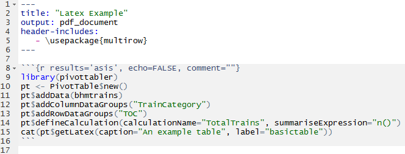
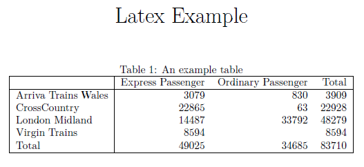

## In This Vignette

* What is Latex?
* Example Pivot Table
* Rendering a Pivot Table in Latex
* Rendering a Pivot Table to PDF via R Markdown
* Styling a Pivot Table in Latex
* Rendering part of a Pivot Table
* Further Reading

## What is Latex?

Latex is used to write documents.  Latex documents are written in plain-text that contains tags for defining the structure and formatting of the document, i.e. a different approach compared to typical WYSIWYG document editors like Microsoft Word.  Latex is widely used in academia for the publishing of scientific papers.

A trivial example of a Latex document is:

```{r, warning=FALSE, comment="", echo=FALSE}
s <- "\\documentclass{article}\n\\begin{document}\nHello World!\n\\end{document}"
cat(s)
```

For more information see [Wikipedia](https://en.wikipedia.org/wiki/LaTeX) or [Latex-Tutorial.com](https://www.latex-tutorial.com/tutorials/).

A helpful reference for understanding the structure of Latex pivot tables can be found on [wikibooks](https://en.wikibooks.org/wiki/LaTeX/Tables).

## Example Pivot Table

The following pivot table is used as the basis of the examples in the rest of this vignette:

```{r, warning=FALSE}
library(pivottabler)
pt <- PivotTable$new()
pt$addData(bhmtrains)
pt$addColumnDataGroups("TrainCategory")
pt$addRowDataGroups("TOC")
pt$defineCalculation(calculationName="TotalTrains", summariseExpression="n()")
pt$renderPivot()
```

## Rendering a Pivot Table in Latex

A `pivottabler` pivot table can be output in Latex using the `pt$getLatex()` function.  The Latex for the example pivot table above is:

```{r, warning=FALSE, comment="", echo=FALSE}
library(pivottabler)
pt <- PivotTable$new()
pt$addData(bhmtrains)
pt$addColumnDataGroups("TrainCategory")
pt$addRowDataGroups("TOC")
pt$defineCalculation(calculationName="TotalTrains", summariseExpression="n()")
pt$evaluatePivot()
cat(pt$getLatex())
```

The caption for the table can be specified using the `caption` argument when calling the `pt$getLatex()` function.  The table label, used to cross-reference the table in other parts of the document, can be specified using the `label` argument.  Both of these arguments are illustrated in the examples below.

## Rendering a Pivot Table to PDF via R Markdown

R Markdown can be used to create PDF documents.  R Markdown is compiled to a PDF document using the knitr package and pandoc, via Latex.  This allows the `pt$getLatex()` function to be used with R Markdown to generate tables in PDF documents.

The multirow latex package is used to allow table cells to span multiple rows.  Note the header-include in the R Markdown example below. 

A minimal example using an R Markdown file:


  
<br />

When the PDF is generated, the resulting table appears as:



<br />
  
When multiple row/column groups are present, additional lines are drawn within the table:


## Styling a Pivot Table in Latex

Styling Latex has a great many differences compared to styling HTML.  Therefore the HTML-based approaches to styling a `pivottabler` pivot table, as described in the [Styling](styling.html) vignette, do not apply to tables generated in Latex.

It is expected that under many scenarios when creating Latex documents, styling will be carried out by-hand, i.e. editing the Latex code directly.  Therefore the `pivottabler` package does not offer many styling capabilities for Latex pivot tables.

A couple of basic options for styling the pivot table headers are offered, controlled by setting either/both of the `boldHeadings` and/or `italicHeadings` arguments to `TRUE` when calling `pt$getLatex()`.  For example, specifying `italicHeadings=TRUE`:


## Rendering part of a Pivot Table

Pivot tables can easily grow to be larger than the height/width of a single A4 page.  To split a pivot table across multiple pages, the following arguments can be specified when calling `pt$getLatex()`:

- `fromRow`
- `toRow`
- `fromColumn`
- `toColumn`

Integer numbers should be specified for these arguments.  The numbers are 1-based and specify the cells in the body of the pivot table only, i.e. they do not include either the row/column headings.  In the example pivot table above:

- the Arriva Trains Wales, Express Passenger cell with value 3079 is at row 1, column 1.
- the London Midland, Ordinary Passenger cell with value 33792 is at row 3, column 2.
- the Total, Total cell with value 83710 is at row 5, column 3.

## Further Reading

The full set of vignettes is:

1. [Introduction](introduction.html)
2. [Data Groups](datagroups.html)
3. [Calculations](calculations.html)
4. [Outputs](outputs.html)
5. [Latex Output](latexoutput.html)
6. [Styling](styling.html)
7. [Finding and Formatting](findandformatting.html)
8. [Cell Context](cellcontext.html)
9. [Custom Layouts](customlayouts.html)
10. [Shiny](shiny.html)
