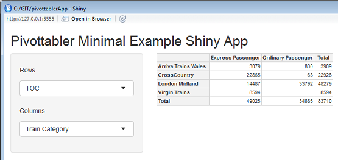

## In This Vignette

* About Shiny
* Examples
* Example 1:  Minimal Example
* Example 2:  Comparing pairs of variables

## About Shiny

Shiny is an R package that makes it easy to build interactive web applications (apps) straight from R.

Good starting points for using Shiny are:

* [Overview](https://shiny.rstudio.com/)
* [Video Tutorial](https://shiny.rstudio.com/tutorial/)
* [Older Written Tutorial](https://shiny.rstudio.com/tutorial/lesson1/)
* [Detailed Written Articles](https://shiny.rstudio.com/articles/)

## Examples

This vignette presents a couple of examples to get started using 'pivottabler' with Shiny.  They are not intended to be fully featured applications, rather they are intended to help the reader get started quickly using `pivottabler` with Shiny.

To use each of these examples, create a new single-file Shiny web application in RStudio, then paste the R code into the app.R file.

## Example 1:  Minimal Example

```{r, message=FALSE, warning=FALSE, eval=FALSE}
library(shiny)
library(htmlwidgets)
library(pivottabler)

ui <- fluidPage(

   titlePanel("Pivottabler Minimal Example Shiny App"),

   sidebarLayout(
      sidebarPanel(

         selectInput("selectRows", label = h5("Rows"),
                     choices = list("Train Category" = "TrainCategory",
                                    "TOC" = "TOC",
                                    "Power Type" = "PowerType"), selected = "TOC"),
         selectInput("selectCols", label = h5("Columns"),
                     choices = list("Train Category" = "TrainCategory",
                                    "TOC" = "TOC",
                                    "Power Type" = "PowerType"), selected = "TrainCategory")
      ),

      mainPanel(
         pivottablerOutput('pvt')
      )
   )
)

server <- function(input, output) {

   output$pvt <- renderPivottabler({
     pt <- PivotTable$new()
     pt$addData(bhmtrains)
     pt$addColumnDataGroups(input$selectCols)
     pt$addRowDataGroups(input$selectRows)
     pt$defineCalculation(calculationName="TotalTrains", summariseExpression="n()")
     pt$evaluatePivot()
     pivottabler(pt)
   })
}

shinyApp(ui = ui, server = server)
```




## Example 2:  Comparing pairs of variables

```{r, message=FALSE, warning=FALSE, eval=FALSE}
library(shiny)
library(htmlwidgets)
library(pivottabler)
library(dplyr)
library(lubridate)

getDelayBand <- function(delayMinutes) {
  if(is.na(delayMinutes)) return(NA)
  else if(delayMinutes <= 0) return(0)
  else if(delayMinutes <= 1) return(1)
  else if(delayMinutes <= 2) return(2)
  else if(delayMinutes <= 5) return(5)
  else if(delayMinutes <= 10) return(10)
  else if(delayMinutes <= 15) return(15)
  else if(delayMinutes <= 20) return(20)
  else if(delayMinutes <= 30) return(30)
  else if(delayMinutes <= 45) return(45)
  else if(delayMinutes <= 60) return(60)
  else if(delayMinutes <= 90) return(90)
  else if(delayMinutes <= 120) return(120)
  else if(delayMinutes <= 180) return(180)
  else if(delayMinutes <= 240) return(240)
  else if(delayMinutes <= 300) return(300)
  else return(999)
}

getDelayBands <- function(delayMinutes) {
  return(sapply(delayMinutes, getDelayBand))
}

stations <- mutate(trainstations, CrsCodeChr=as.character(CrsCode))
trains <- bhmtrains %>%
  mutate(OriginChr=as.character(Origin), DestinationChr=as.character(Destination)) %>%
  inner_join(stations, by=c("OriginChr"="CrsCodeChr")) %>%
  inner_join(stations, by=c("DestinationChr"="CrsCodeChr")) %>%
  select(Status, TOC, TrainCategory, PowerType, SchedSpeedMPH,
         Origin=StationName.x, OriginGbttDeparture, OriginActualDeparture,
         GbttArrival, ActualArrival, GbttDeparture, ActualDeparture,
         Destination=StationName.y, DestinationGbttArrival, DestinationActualArrival) %>%
  mutate(Status=recode(Status, "A"="Normal", "C"="Cancelled", "R"="Reinstated"),
         GbttDateTime=if_else(is.na(GbttArrival), GbttDeparture, GbttArrival),
         GbttHourOfDay=hour(GbttDateTime),
         GbttDate=make_date(year=year(GbttDateTime), month=month(GbttDateTime), day=day(GbttDateTime)),
         GbttMonth=make_date(year=year(GbttDateTime), month=month(GbttDateTime), day=1),
         ArrivalDeltaMins=difftime(ActualArrival, GbttArrival, units="mins"),
         ArrivalDelayMins=ifelse(ArrivalDeltaMins<0, 0, ArrivalDeltaMins),
         ArrivalDelayBand=getDelayBands(ArrivalDelayMins)) %>%
  select(Status, TOC, TrainCategory, PowerType, SchedSpeedMPH, Origin, Destination,
         GbttMonth, GbttDate, GbttHourOfDay, ArrivalDeltaMins, ArrivalDelayMins, ArrivalDelayBand)

ui <- fluidPage(

  titlePanel("Pivottabler Minimal Example Shiny App"),

  fluidRow(
    column(4,
      selectInput("selectRows", label = "Rows", choices=list(""))
    ),
    column(4,
      selectInput("selectCols", label = "Columns", choices=list(""))
    ),
    column(4,
      selectInput("selectCalc", label = "Calculation",
                     choices = list("Total Trains", "Total Delay Minutes"), selected = "Total Trains")
    )
  ),

  hr(),

  pivottablerOutput('pvt')
)

server <- function(input, output, session) {

  observe({
    isolate({
    sr <- input$selectRows
    sc <- input$selectCols

    updateSelectInput(session, "selectRows",
      label = "Rows",
      choices = names(trains)
    )
    updateSelectInput(session, "selectCols",
      label = "Columns",
      choices = names(trains)
    )
    })
  })

  output$pvt <- renderPivottabler({
   if((length(input$selectRows)>0)&&(nchar(input$selectRows)>0)) {
   pt <- PivotTable$new()
   trains2 <- trains %>%
     group_by_(input$selectCols, input$selectRows) %>%
     summarise(TotalTrains=n(), DelayMinutes=sum(ArrivalDelayMins, na.rm=TRUE)) %>%
     ungroup()
   pt$addData(trains2)
   pt$addColumnDataGroups(input$selectCols)
   pt$addRowDataGroups(input$selectRows)
   if(input$selectCalc=="Total Trains")
     pt$defineCalculation(calculationName="TotalTrains", summariseExpression="sum(TotalTrains)")
   else if (input$selectCalc=="Total Delay Minutes")
     pt$defineCalculation(calculationName="ToalDelayMinutes",
                          summariseExpression="sum(DelayMinutes, na.rm=TRUE)")
   pt$evaluatePivot()
   pivottabler(pt)
   }
  })
}

shinyApp(ui = ui, server = server)
```


## Further Reading

The full set of vignettes is:

1. [Introduction](introduction.html)
2. [Data Groups](datagroups.html)
3. [Calculations](calculations.html)
4. [Outputs](outputs.html)
5. [Latex Output](latexoutput.html)
6. [Styling](styling.html)
7. [Finding and Formatting](findingandformatting.html)
8. [Cell Context](cellcontext.html)
9. [Irregular Layout](irregularlayout.html)
10. [Shiny](shiny.html)
