## Introduction

This is a shortened introduction to the `pivottabler` package.

A longer version of this introduction plus many other articles and examples can be found at:  [http://www.pivottabler.org.uk/articles](http://www.pivottabler.org.uk/articles/)

## Contents

* Introducing pivottabler
* Basic Pivot Table
* Constructing the Basic Pivot Table
* Outputting the Pivot Table as Plain Text
* Extending the Basic Pivot Table
* Outline Layout
* Quick-Pivot Functions
* Examples Gallery
* Further Reading

## Introducing pivottabler

The `pivottabler` package enables pivot tables to be created and rendered/exported with just a few lines of R.

Pivot tables are constructed natively in R, either via a short one line command to build a basic pivot table or via series of R commands that gradually build a more bespoke pivot table to meet your needs. 

The `pivottabler` package:

- provides a simple framework for specifying and aggregating data, based on either the dplyr package or the data.table package.  
- provides optional hooks for specifying custom calculations/aggregations for more complex scenarios
    + This allows a wide-range of R functions, including custom functions written in R, to be used in the calculation logic.
- does not require the user to specify low-level layout logic.
- supports output in multiple formats as well as converting a pivot table to either a standard R matrix or data frame.

Since pivot tables are primarily visualisation tools, the pivottabler package offers several custom styling options as well as conditional/custom formatting capabilities so that the pivot tables can be themed/branded as needed.

Output can be rendered as:

- HTML, including via the htmlwidgets framework, 
- Latex, e.g. to PDF, or
- Plain text, e.g. to the console.  

The generated HTML, Latex and text can also be easily retrieved, e.g. to be used outside of R

The pivot tables can also be exported to Excel, including the styling/formatting.

`pivottabler` is a companion package to the `basictabler` package.  `pivottabler` is focussed on generating pivot tables and can aggregate data.  `basictabler` does not aggregate data but offers more control of table structure.

The latest version of the pivottabler package can be obtained directly from the [package repository](https://github.com/cbailiss/pivottabler/).  Please log any questions not answered by the vignettes or any bug reports [here](https://github.com/cbailiss/pivottabler/issues).

## Basic Pivot Table

Suppose we want to answer the question:  How many ordinary/express passenger trains did each train operating company (TOC) operate in the three month period?

Either of the following sets of code will generate the relevant pivot table:

```{r, eval=FALSE}
library(pivottabler)
# arguments:  qhpvt(dataFrame, rows, columns, calculations, ...)
qhpvt(bhmtrains, "TOC", "TrainCategory", "n()") # TOC = Train Operating Company 
```

<!-- Warning=FALSE since the above renderBasicTable seems to cause a random warning in the code below:
## Warning in combine_vars(vars, ind_list): '.Random.seed' is not an integer
## vector but of type 'NULL', so ignored
i.e. disable the renderBasicTable() call and the warning disappears - very odd.
--> 
```{r, eval=FALSE}
library(pivottabler)
pt <- PivotTable$new()
pt$addData(bhmtrains)
pt$addColumnDataGroups("TrainCategory")
pt$addRowDataGroups("TOC")
pt$defineCalculation(calculationName="TotalTrains", summariseExpression="n()")
pt$renderPivot()
```

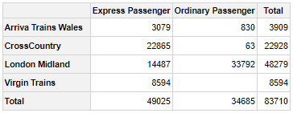

The first block of code above uses a quick pivot function.  The second block of code is the verbose version.  Both produce the same pivot table and output, but the verbose version helps more clearly explain the steps involved in constructing the pivot table.

Each line in the verbose version works as follows:

1. Load the namespace of the pivottabler library.
2. Create a new pivot table instance^[pivottabler is implemented in [R6 Classes](https://CRAN.R-project.org/package=R6) so pt here is an instance of the R6 PivotTable class.].
3. Specify the data frame that contains the data for the pivot table.
4. Add the distinct values from the TrainCategory column in the data frame as columns in the pivot table.
5. Add the distinct values from the TOC column in the data frame as rows in the pivot table.
6. Specify the calculation.  The summarise expression must be an expression that can be used with the dplyr summarise() function.  This expression is used internally by the pivottabler package with the dplyr summarise function.  `pivottabler` also supports data.table.
7. Generate the pivot table.

## Constructing the Basic Pivot Table

The following examples show how each line in the above example constructs the pivot table.  To improve readability, each code change is highlighted.

```{r, eval=FALSE}
# produces no pivot table
library(pivottabler)
pt <- PivotTable$new()
pt$addData(bhmtrains)
pt$renderPivot()
```

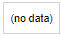

```{r, eval=FALSE}
# specify the column headings
library(pivottabler)
pt <- PivotTable$new()
pt$addData(bhmtrains)
pt$addColumnDataGroups("TrainCategory")   #    << **** LINE ADDED **** <<
pt$renderPivot()
```

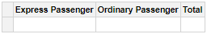

```{r, eval=FALSE}
# specify the row headings
library(pivottabler)
pt <- PivotTable$new()
pt$addData(bhmtrains)
pt$addColumnDataGroups("TrainCategory")
pt$addRowDataGroups("TOC")                #    << **** LINE ADDED **** <<
pt$renderPivot()
```

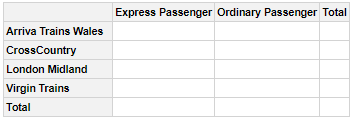

```{r, eval=FALSE}
# specifying a calculation
library(pivottabler)
pt <- PivotTable$new()
pt$addData(bhmtrains)
pt$addColumnDataGroups("TrainCategory")
pt$addRowDataGroups("TOC")                #     **** LINE BELOW ADDED ****
pt$defineCalculation(calculationName="TotalTrains", summariseExpression="n()")
pt$renderPivot()
```


## Outputting the Pivot Table as Plain Text

The pivot table can be rendered as plain text to the console by using `pt`:

```{r, eval=FALSE, comment=""}
library(pivottabler)
pt <- PivotTable$new()
pt$addData(bhmtrains)
pt$addColumnDataGroups("TrainCategory")
pt$addRowDataGroups("TOC")
pt$defineCalculation(calculationName="TotalTrains", summariseExpression="n()")
pt$evaluatePivot()
pt
```


## Extending the Basic Pivot Table

There follows below a progressive series of changes to the basic pivot table shown above.  Each change is made by adding or changing one line of code.  Again, to improve readability, each code change is highlighted.

First, adding an additional column data group to sub-divide each "TrainCategory" by "PowerType":

```{r, eval=FALSE}
library(pivottabler)
pt <- PivotTable$new()
pt$addData(bhmtrains)
pt$addColumnDataGroups("TrainCategory")
pt$addColumnDataGroups("PowerType")    #    << **** CODE CHANGE **** <<
pt$addRowDataGroups("TOC")
pt$defineCalculation(calculationName="TotalTrains", summariseExpression="n()")
pt$renderPivot()
```


By default, the new data group does not expand the existing "TrainCategory" total.  However, an additional argument allows the total column to also be expanded:

```{r, eval=FALSE}
library(pivottabler)
pt <- PivotTable$new()
pt$addData(bhmtrains)
pt$addColumnDataGroups("TrainCategory")
pt$addColumnDataGroups("PowerType", expandExistingTotals=TRUE) # << ** CODE CHANGE ** <<
pt$addRowDataGroups("TOC")
pt$defineCalculation(calculationName="TotalTrains", summariseExpression="n()")
pt$renderPivot()
```

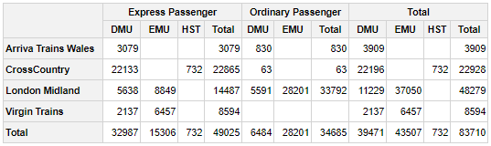

Instead of adding "PowerType" as columns, it can also be added as rows:

```{r, eval=FALSE}
library(pivottabler)
pt <- PivotTable$new()
pt$addData(bhmtrains)
pt$addColumnDataGroups("TrainCategory")
pt$addRowDataGroups("TOC")
pt$addRowDataGroups("PowerType")    #    << **** CODE CHANGE **** <<
pt$defineCalculation(calculationName="TotalTrains", summariseExpression="n()")
pt$renderPivot()
```


It is possible to continue adding additional data groups.  The pivottabler does not enforce a maximum depth of data groups.  For example, adding the maximum scheduled speed to the rows:

```{r, eval=FALSE}
library(pivottabler)
pt <- PivotTable$new()
pt$addData(bhmtrains)
pt$addColumnDataGroups("TrainCategory")
pt$addRowDataGroups("TOC")
pt$addRowDataGroups("PowerType")
pt$addRowDataGroups("SchedSpeedMPH")    #    << **** CODE CHANGE **** <<
pt$defineCalculation(calculationName="TotalTrains", summariseExpression="n()")
pt$renderPivot()
```


As more data groups are added, the pivot table can seem overwhelmed with totals.  It is possible to selectively show/hide totals using the `addTotal` argument.  Totals can be renamed using the `totalCaption` argument.  Both of these options are demonstrated below.

```{r, eval=FALSE}
library(pivottabler)
pt <- PivotTable$new()
pt$addData(bhmtrains)
pt$addColumnDataGroups("TrainCategory")
pt$addRowDataGroups("TOC", totalCaption="Grand Total")    #    << **** CODE CHANGE **** <<
pt$addRowDataGroups("PowerType")
pt$addRowDataGroups("SchedSpeedMPH", addTotal=FALSE)      #    << **** CODE CHANGE **** <<
pt$defineCalculation(calculationName="TotalTrains", summariseExpression="n()")
pt$renderPivot()
```

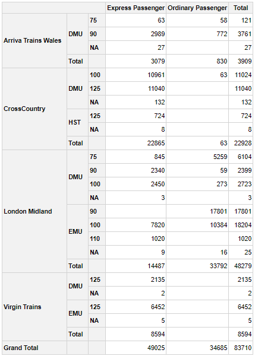

This can then be rendered in outline layout: 

```{r, eval=FALSE}
library(pivottabler)
pt <- PivotTable$new()
pt$addData(bhmtrains)
pt$addColumnDataGroups("TrainCategory")
pt$addRowDataGroups("TOC", 
                    outlineBefore=list(isEmpty=FALSE, 
                                       groupStyleDeclarations=list(color="blue")), 
                    outlineTotal=list(groupStyleDeclarations=list(color="blue")))
pt$addRowDataGroups("PowerType", addTotal=FALSE)
pt$addRowDataGroups("SchedSpeedMPH", addTotal=FALSE)
pt$defineCalculation(calculationName="TotalTrains", summariseExpression="n()")
pt$renderPivot()
```


## Outline Layout

Outline layout renders row data groups as headings:

```{r, eval=FALSE}
library(pivottabler)
pt <- PivotTable$new()
pt$addData(bhmtrains)
pt$addColumnDataGroups("TrainCategory")
pt$addRowDataGroups("TOC",
                    outlineBefore=list(groupStyleDeclarations=list(color="blue")),
                    outlineAfter=list(isEmpty=FALSE,
                                      mergeSpace="dataGroupsOnly",
                                      caption="Total ({value})",
                                      groupStyleDeclarations=list("font-style"="italic")),
                    outlineTotal=list(groupStyleDeclarations=list(color="blue"),
                                      cellStyleDeclarations=list("color"="blue")))
pt$addRowDataGroups("PowerType", addTotal=FALSE)
pt$defineCalculation(calculationName="TotalTrains", summariseExpression="n()")
pt$renderPivot()
```


## Quick-Pivot Functions

To construct basic pivot tables quickly, three functions are provided that can construct pivot tables with one line of R:

- `qpvt()` returns a pivot table.  Setting a variable equal to the return value, e.g. `pt <- qpvt(...)`, allows further operations to be carried out on the pivot table.  Otherwise, using `qpvt(...)` alone will simply print the pivot table to the console and then discard it.
- `qhpvt()` returns a HTML widget that when used alone will render a HTML representation of  the pivot table (e.g. in the R-Studio "Viewer" pane).
- `qlpvt()` returns a Latex representation of a pivot table. 

These functions do not offer all of the options that are available when constructing a pivot table using the more verbose syntax.

The arguments to all three functions are essentially the same:

- `dataFrame` specifies the data frame that contains the pivot table data.
- `rows` specifies the names of the variables (as a character vector) used to generate the row data groups.
- `columns` specifies the names of the variables (as a character vector) used to generate the column data groups.
- `calculations` specifies the summary calculations (as a character vector) used to calculate the cell values in the pivot table.  The names of the elements in this vector become the calculation names (and so the calculation headings when more than one calculation is present in the pivot table).
- `format` specifies the same formatting for all calculations (as either a character value, list or R function).  See the "Formatting calculated values" section of the Calculations vignette for more details.
- `formats` specifies a different format for each calculation (as a list of the same length as `calculations` containing any combination of character values, lists or R functions).
- `totals` specifies which totals are shown and can also control the captions of totals.  This is described in more detail below.

Specifying "=" in either the `rows` or `columns` vectors sets the position of the calculations in the row/column headings.

A basic example of quickly printing a pivot table to the console: 

```{r, eval=FALSE, comment=""}
library(pivottabler)
qpvt(bhmtrains, "TOC", "TrainCategory", "n()")
```

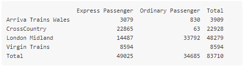

A slightly more complex pivot table being quickly rendered as a HTML widget, where the calculation headings are on the rows: 

```{r, eval=FALSE}
library(pivottabler)
qhpvt(bhmtrains, c("=", "TOC"), c("TrainCategory", "PowerType"),
    c("Number of Trains"="n()", "Maximum Speed"="max(SchedSpeedMPH, na.rm=TRUE)"))
```


A quick pivot table with a format specified:

```{r, eval=FALSE}
library(pivottabler)
qhpvt(bhmtrains, "TOC", "TrainCategory", "mean(SchedSpeedMPH, na.rm=TRUE)", format="%.0f")
```


A quick pivot table with two calculations that are formatted differently:

```{r, eval=FALSE}
library(pivottabler)
qhpvt(bhmtrains, "TOC", "TrainCategory", 
     c("Mean Speed"="mean(SchedSpeedMPH, na.rm=TRUE)", "Std Dev Speed"="sd(SchedSpeedMPH, na.rm=TRUE)"), 
     formats=list("%.0f", "%.1f"))
```


In the above pivot table, the "Total" would be better renamed to something like "All" or "Overall" since a total for a mean or standard deviation does not make complete sense.

Totals can be controlled using the `totals` argument.  This works as follows:

* If not specified, then totals are generated for all variables.
* To hide all totals, specify `totals=NONE`.
* To specify which variables have totals, specify the names of the variables in a character vector, e.g. in a pivot table containing the variables x, y and z, to display totals only for variables x and z, specify `totals=c("x", "z")`.
* To specify which variables have totals and also rename the captions of the total cells, specify a list, e.g. to rename the totals for x to "All x" and y to "All y", specify `totals=list("x"="All x", "y"="All y")`.

Returning to the previous quick pivot example, the totals can now be renamed to "All ..." using:

```{r, eval=FALSE}
library(pivottabler)
qhpvt(bhmtrains, "TOC", "TrainCategory", 
     c("Mean Speed"="mean(SchedSpeedMPH, na.rm=TRUE)", "Std Dev Speed"="sd(SchedSpeedMPH, na.rm=TRUE)"), 
     formats=list("%.0f", "%.1f"), totals=list("TOC"="All TOCs", "TrainCategory"="All Categories"))
```


## Examples Gallery
 
Various examples of using the `pivottabler` package are shown below. Please see the gallery at the bottom of the full introduction [here](http://www.pivottabler.org.uk/articles/v01-introduction.html) for links to other articles showing how to construct these examples.

### Multiple Levels & Formatted Data Groups


### Multiple Calculations & Calculations on Rows

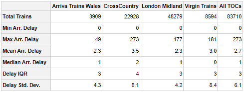

### Custom Calculations

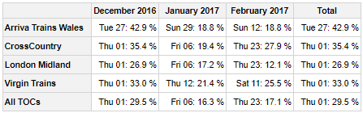

### Outline Layout


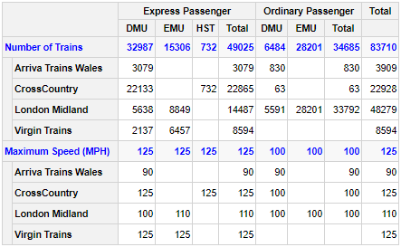


### Results as a Matrix

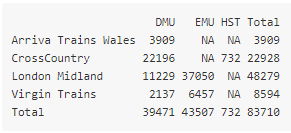

### Latex Output


### Styling


### Finding and Formatting Data Groups

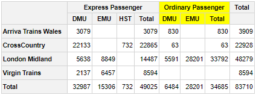

### Finding and Formatting Cells


### Conditional Formatting

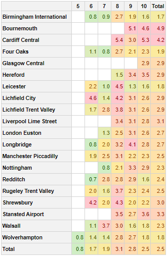

### Mixing Data Groups and/or Calculations


### Combining Pivot Tables

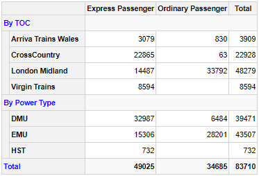

## Further Reading

More information can be found at [http://www.pivottabler.org.uk/](http://www.pivottabler.org.uk/).

A longer version of this introduction can be found [here](http://www.pivottabler.org.uk/articles/v01-introduction.html).

The full set of package vignettes can be found [here](http://www.pivottabler.org.uk/articles/).
