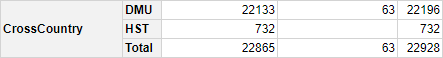
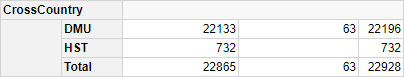

## In This Vignette

* Introduction
* What is Regular Layout?
* Types of Regular Layout
* Tabular Layout
* Outline Layout
* Outline Layout Settings
* Multiple Level Outline Layout Example
* Outline Calculation Example
* Irregular Layout
* Further Reading

## Introduction

This page defines "regular layout" then describes the two main types of regular layout that are supported by the `pivottabler` package.  Most of this page is spent discussing the more advanced "outline" layout. 

## What is Regular Layout?

Consider the following  example pivot table:

```{r, message=FALSE, warning=FALSE}
library(pivottabler)
pt <- PivotTable$new()
pt$addData(bhmtrains)
pt$addColumnDataGroups("TrainCategory")
pt$addColumnDataGroups("PowerType")
pt$addRowDataGroups("TOC")
pt$defineCalculation(calculationName="TotalTrains", summariseExpression="n()")
pt$renderPivot()
```

This is a regular pivot table because each level of row and column headings is related to a single variable only, i.e.

- The first level of column headings ("Express Passenger", "Ordinary Passenger", etc.) are all related to the "TrainCategory" variable.
- The second level of column headings ("DMU", "EMU", etc.) are all related to the "PowerType" variable.
- The first level of row headings ("Arriva Trains Wales", "CrossCountry", etc.)  are all related to the "TOC" (Train Operating Company) variable.

## Types of Regular Layout

The `pivottabler` package supports broadly two types of regular layout:

- Tabular Layout
- Outline Layout

These layout types can be mixed in a pivot table.

## Tabular Layout

Tabular layout is the simplest pivot table layout.  Where there are multiple levels of row or column data groups, then the child groups are rendered "under" the parent group.  For column data groups, that is directly under the parent.  For row data groups, that is to the right of the parent.

There are no additional settings for tabular layout.

The pivot table shown above is an example of a pivot table using a tabular layout.  Another example of a pivot table using tabular layout is shown below.

```{r, message=FALSE, warning=FALSE}
library(pivottabler)
pt <- PivotTable$new()
pt$addData(bhmtrains)
pt$addColumnDataGroups("TrainCategory")
pt$addRowDataGroups("TOC")
pt$addRowDataGroups("PowerType")
pt$defineCalculation(calculationName="TotalTrains", summariseExpression="n()")
pt$renderPivot()
```

## Outline Layout

Outline layout is an alternative way of rendering row data groups.  Parent row data groups are rendered as headers just above the child data groups (i.e. vertically above).  The last level of row data groups is not specified to use outline layout and remains using tabular layout.

Outline layout is useful when the row data group captions are longer since the text can flow to the right.  Outlined row data groups act as separators in the pivot table, which can sometimes make the pivot table easier to read.

Outline layout does not apply to the column data groups - since the text for column data groups already naturally flows to the right.

Outline layout usually makes pivot tables narrower (i.e. reduced width) and longer (i.e. taller vertically).

The simplest way to enable outline layout is to specify `outlineBefore=TRUE` as an argument when adding the parent row data groups.

```{r, message=FALSE, warning=FALSE}
library(pivottabler)
pt <- PivotTable$new()
pt$addData(bhmtrains)
pt$addColumnDataGroups("TrainCategory")
pt$addRowDataGroups("TOC", outlineBefore=TRUE)
pt$addRowDataGroups("PowerType")
pt$defineCalculation(calculationName="TotalTrains", summariseExpression="n()")
pt$renderPivot()
```

Comparing one row data group (comprised of two levels, "TOC" and "Power Type"):



<br />



<br />

Outline layout creates a new row for TOC "CrossCountry" and makes the caption of the normal "CrossCountry" group blank.


<br />

Even though the caption is blank, this row is still applying the "TOC=CrossCountry" filtering, i.e. the numbers are the same in both the tabular layout and outline layout.

The example pivot table above uses `outlineBefore=TRUE`, which adds a header row above each row data group.  By default, the caption of this data group is the data group value.

It is also possible to specify `outlineAfter=TRUE`.  This adds a footer row below each rowdata group.  By default, the caption of this data group is blank.


<br />

When additional variables are added to the row groups, the new rows for the outline groups are never broken down by the newly added variable, e.g. when "PowerType" was added to the example above, the two new rows were not broken down into "DMU", "HST", etc.

An example of a pivot table showing the outline rows before and after:

```{r, message=FALSE, warning=FALSE}
library(pivottabler)
pt <- PivotTable$new()
pt$addData(bhmtrains)
pt$addColumnDataGroups("TrainCategory")
pt$addRowDataGroups("TOC", outlineBefore=TRUE, outlineAfter=TRUE)
pt$addRowDataGroups("PowerType")
pt$defineCalculation(calculationName="TotalTrains", summariseExpression="n()")
pt$renderPivot()
```

## Outline Layout Settings

Some aspects of the outline layout can be specifically controlled.  This is done by specifying a list of settings for the `outlineBefore`, `outlineAfter` and/or `outlineTotal` arguments.

### The `mergeSpace` Setting

`mergeSpace` controls how the empty space to the right of the outline row is merged.

#### doNotMerge

This specifies that nothing should be merged.

```{r, message=FALSE, warning=FALSE}
library(pivottabler)
pt <- PivotTable$new()
pt$addData(bhmtrains)
pt$addColumnDataGroups("TrainCategory")
pt$addRowDataGroups("TOC", outlineBefore=list(mergeSpace="doNotMerge"))
pt$addRowDataGroups("PowerType")
pt$defineCalculation(calculationName="TotalTrains", summariseExpression="n()")
pt$renderPivot()
```

#### dataGroupsOnly

This specifies that only the row headings should be merged.

```{r, message=FALSE, warning=FALSE}
library(pivottabler)
pt <- PivotTable$new()
pt$addData(bhmtrains)
pt$addColumnDataGroups("TrainCategory")
pt$addRowDataGroups("TOC", outlineBefore=list(mergeSpace="dataGroupsOnly"))
pt$addRowDataGroups("PowerType")
pt$defineCalculation(calculationName="TotalTrains", summariseExpression="n()")
pt$renderPivot()
```

#### cellsOnly

This specifies that only the cells should be merged.

```{r, message=FALSE, warning=FALSE}
library(pivottabler)
pt <- PivotTable$new()
pt$addData(bhmtrains)
pt$addColumnDataGroups("TrainCategory")
pt$addRowDataGroups("TOC", outlineBefore=list(mergeSpace="cellsOnly"))
pt$addRowDataGroups("PowerType")
pt$defineCalculation(calculationName="TotalTrains", summariseExpression="n()")
pt$renderPivot()
```

#### dataGroupsAndCellsAs2

This specifies that the row headings should be merged into one combined row heading and that the cells should be merged into one cell.  This is the default used when `outlineBefore=TRUE` is specified. 

```{r, message=FALSE, warning=FALSE}
library(pivottabler)
pt <- PivotTable$new()
pt$addData(bhmtrains)
pt$addColumnDataGroups("TrainCategory")
pt$addRowDataGroups("TOC", outlineBefore=list(mergeSpace="dataGroupsAndCellsAs2"))
pt$addRowDataGroups("PowerType")
pt$defineCalculation(calculationName="TotalTrains", summariseExpression="n()")
pt$renderPivot()
```

#### dataGroupsAndCellsAs1

This specifies that the row headings and cells should all be merged into one. 

```{r, message=FALSE, warning=FALSE}
library(pivottabler)
pt <- PivotTable$new()
pt$addData(bhmtrains)
pt$addColumnDataGroups("TrainCategory")
pt$addRowDataGroups("TOC", outlineBefore=list(mergeSpace="dataGroupsAndCellsAs1"))
pt$addRowDataGroups("PowerType")
pt$defineCalculation(calculationName="TotalTrains", summariseExpression="n()")
pt$renderPivot()
```

### The `isEmpty` Setting

Normally the outline row data groups have no values in the corresponding cells in those rows in the pivot table.  

Specifying `isEmpty=FALSE` will instead show the corresponding calculation values in the cells of the outline rows.  This corresponds to the total of the values from the child groups.  Typically, when `isEmpty=FALSE` is specified for the parent row data group, then the total rows are switched off for the child data groups by specifying `addTotal=FALSE`. 

```{r, message=FALSE, warning=FALSE}
library(pivottabler)
pt <- PivotTable$new()
pt$addData(bhmtrains)
pt$addColumnDataGroups("TrainCategory")
pt$addRowDataGroups("TOC", 
                    outlineBefore=list(isEmpty=FALSE, mergeSpace="dataGroupsOnly"))
pt$addRowDataGroups("PowerType", addTotal=FALSE)
pt$defineCalculation(calculationName="TotalTrains", summariseExpression="n()")
pt$renderPivot()
```

`outlineTotal=TRUE` is then typically specified for the parent row data group, so that the heading in the grand total row is rendered in a consistent way to the rest of the outline rows (i.e. as a merged cell, instead of separate cells).

```{r, message=FALSE, warning=FALSE}
library(pivottabler)
pt <- PivotTable$new()
pt$addData(bhmtrains)
pt$addColumnDataGroups("TrainCategory")
pt$addRowDataGroups("TOC", 
                    outlineBefore=list(isEmpty=FALSE, mergeSpace="dataGroupsOnly"), 
                    outlineTotal=TRUE)
pt$addRowDataGroups("PowerType", addTotal=FALSE)
pt$defineCalculation(calculationName="TotalTrains", summariseExpression="n()")
pt$renderPivot()
```

### The `caption` Setting

The caption setting controls the caption shown in the outline data group.  By default the value of the caption setting is `"{value}"`.  Changing the caption allows additional text to be shown.

```{r, message=FALSE, warning=FALSE}
library(pivottabler)
pt <- PivotTable$new()
pt$addData(bhmtrains)
pt$addColumnDataGroups("TrainCategory")
pt$addRowDataGroups("TOC", 
                    outlineBefore=list(caption="TOC:  {value}"))
pt$addRowDataGroups("PowerType")
pt$defineCalculation(calculationName="TotalTrains", summariseExpression="n()")
pt$renderPivot()
```

### The `groupStyleName` and `groupStyleDeclarations` Settings

The `groupStyleName` setting allows a new base style to be specified for the outline groups.  This will completely replace the built-in style.  A style with the corresponding name must exist in the current pivot table theme.  See the [Styling](v07-styling.html) vignette for more details.

In most cases specifying additional styling using the `groupStyleDeclarations` setting is better since this allows additional style declarations to be overlaid onto the base/built-in style.

```{r, message=FALSE, warning=FALSE}
library(pivottabler)
pt <- PivotTable$new()
pt$addData(bhmtrains)
pt$addColumnDataGroups("TrainCategory")
pt$addRowDataGroups("TOC", 
                    outlineBefore=list(groupStyleDeclarations=list(color="blue")))
pt$addRowDataGroups("PowerType")
pt$defineCalculation(calculationName="TotalTrains", summariseExpression="n()")
pt$renderPivot()
```

### The `cellStyleName` and `cellStyleDeclarations` Settings

The `cellStyleName` setting allows a new base style to be specified for the cells in the outline rows.  This will completely replace the built-in style.  A style with the corresponding name must exist in the current pivot table theme.  See the [Styling](v07-styling.html) vignette for more details.

In most cases specifying additional styling using the `cellStyleDeclarations` setting is better since this allows additional style declarations to be overlaid onto the base/built-in style.

```{r, message=FALSE, warning=FALSE}
library(pivottabler)
pt <- PivotTable$new()
pt$addData(bhmtrains)
pt$addColumnDataGroups("TrainCategory")
pt$addRowDataGroups("TOC", 
                    outlineBefore=list(mergeSpace="doNotMerge", 
                                       cellStyleDeclarations=list("background-color"="lightskyblue")))
pt$addRowDataGroups("PowerType")
pt$defineCalculation(calculationName="TotalTrains", summariseExpression="n()")
pt$renderPivot()
```

## Combined Outline Layout Example

The example pivot table below combines several of the outline settings described above.

```{r, message=FALSE, warning=FALSE}
library(pivottabler)
pt <- PivotTable$new()
pt$addData(bhmtrains)
pt$addColumnDataGroups("TrainCategory")
pt$addRowDataGroups("TOC",
                    outlineBefore=list(groupStyleDeclarations=list(color="blue")),
                    outlineAfter=list(isEmpty=FALSE,
                                      mergeSpace="dataGroupsOnly",
                                      caption="Total ({value})",
                                      groupStyleDeclarations=list("font-style"="italic")),
                    outlineTotal=list(groupStyleDeclarations=list(color="blue"),
                                      cellStyleDeclarations=list("color"="blue")))
pt$addRowDataGroups("PowerType", addTotal=FALSE)
pt$defineCalculation(calculationName="TotalTrains", summariseExpression="n()")
pt$renderPivot()
```

## Multiple Level Outline Layout Examples

The example pivot table below adds a third level on the row groups, where both the first and second levels are outlined, leaving the third level in tabular layout.

```{r, message=FALSE, warning=FALSE}
library(pivottabler)
pt <- PivotTable$new()
pt$addData(bhmtrains)
pt$addColumnDataGroups("TrainCategory")
pt$addRowDataGroups("TOC", 
                    outlineBefore=list(isEmpty=FALSE, 
                                       mergeSpace="dataGroupsOnly", 
                                       groupStyleDeclarations=list(color="blue"), 
                                       cellStyleDeclarations=list(color="blue")), 
                    outlineTotal=list(groupStyleDeclarations=list(color="blue"), 
                                      cellStyleDeclarations=list(color="blue")))
pt$addRowDataGroups("PowerType", 
                    addTotal=FALSE, 
                    outlineBefore=list(isEmpty=FALSE, mergeSpace="dataGroupsOnly"))
pt$addRowDataGroups("Status", addTotal=FALSE)
pt$defineCalculation(calculationName="TotalTrains", summariseExpression="n()")
pt$renderPivot()
```

Alternatively, it is possible to outline only the first level, leaving the second and third levels in tabular layout.

```{r, message=FALSE, warning=FALSE}
library(pivottabler)
pt <- PivotTable$new()
pt$addData(bhmtrains)
pt$addColumnDataGroups("TrainCategory")
pt$addRowDataGroups("TOC", 
                    outlineBefore=list(isEmpty=FALSE, 
                                       mergeSpace="dataGroupsOnly", 
                                       groupStyleDeclarations=list(color="blue")),
                    outlineTotal=list(groupStyleDeclarations=list(color="blue")))
pt$addRowDataGroups("PowerType", addTotal=FALSE)
pt$addRowDataGroups("Status")
pt$defineCalculation(calculationName="TotalTrains", summariseExpression="n()")
pt$renderPivot()
```

## Outline Calculation Example

It is also possible to put the calculations on rows in the pivot table and to outline the calculation groups.  

Shown below is a pivot table with calculations on rows in tabular layout:

```{r, message=FALSE, warning=FALSE}
library(pivottabler)
pt <- PivotTable$new()
pt$addData(bhmtrains)
pt$addColumnDataGroups("TrainCategory")
pt$defineCalculation(calculationName="NumberOfTrains", caption="Number of Trains",
                     summariseExpression="n()")
pt$defineCalculation(calculationName="MaximumSpeedMPH", caption="Maximum Speed (MPH)",
                     summariseExpression="max(SchedSpeedMPH, na.rm=TRUE)")
pt$addRowCalculationGroups()
pt$addColumnDataGroups("PowerType")
pt$addRowDataGroups("TOC")
pt$renderPivot()
```

The same pivot table is shown below in outline layout.  In this pivot table, the two calculations on rows are outlined:

```{r, message=FALSE, warning=FALSE}
library(pivottabler)
pt <- PivotTable$new()
pt$addData(bhmtrains)
pt$addColumnDataGroups("TrainCategory")
pt$defineCalculation(calculationName="NumberOfTrains", caption="Number of Trains",
                     summariseExpression="n()")
pt$defineCalculation(calculationName="MaximumSpeedMPH", caption="Maximum Speed (MPH)",
                     summariseExpression="max(SchedSpeedMPH, na.rm=TRUE)")
pt$addColumnDataGroups("PowerType")
pt$addRowCalculationGroups(outlineBefore=list(isEmpty=FALSE, mergeSpace="dataGroupsOnly", 
                                              groupStyleDeclarations=list(color="blue"), 
                                              cellStyleDeclarations=list(color="blue")))
pt$addRowDataGroups("TOC", addTotal=FALSE)
pt$renderPivot()
```

## Irregular Layout

All of the pivot tables on this page have used regular layout, i.e. where each level of row or column data groups relates to only one variable.  It is possible to construct custom pivot tables using irregular layout.  See [Irregular Layout](v10-irregularlayout.html) for details.

## Further Reading

The full set of vignettes is:

1. [Introduction](v01-introduction.html)
2. [Data Groups](v02-datagroups.html)
3. [Calculations](v03-calculations.html)
4. [Regular Layout](v04-regularlayout.html)
5. [Outputs](v05-outputs.html)
6. [Latex Output](v06-latexoutput.html)
7. [Styling](v07-styling.html)
8. [Finding and Formatting](v08-findingandformatting.html)
9. [Cell Context](v09-cellcontext.html)
10. [Irregular Layout](v10-irregularlayout.html)
11. [Performance](v11-performance.html)
12. [Excel Export](v12-excelexport.html)
13. [Shiny](v13-shiny.html)
14. [Appendix: Details](vA1-appendix.html)
15. [Appendix: Calculations](vA2-appendix.html)
16. [Appendix: Class Overview](vA3-appendix.html)
