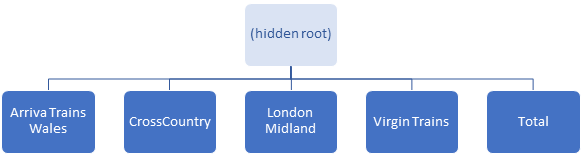
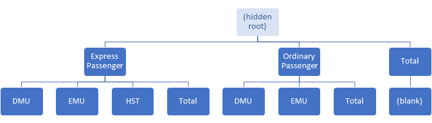

## In This Vignette

- High Level Methods vs. Low Level Methods
- Navigating Data Groups
- Navigating Cells
- Navigating between data groups and rows / columns / cells

## High Level Methods vs. Low Level Methods

Most of the previous vignettes have utilised "high-level" methods to relatively quickly build a pivot table with a minmum of code and without having to worry about low-level structures and layout.  Such high-level methods include:

- `qpvt()`, `qhpvt()` and `qlpvt()` to build and output an entire pivot table in a single function call.
- `pt$addColumnDataGroups()` and `pt$addRowDataGroups()` - to add multiple column/row data groups in a single method call.
- `pt$evaluatePivot()` - to execute all of the following if they have not yet been executed:
  + `pt$normaliseColumnGroups()` - to ensure all of the column data groups have the same depth.
  + `pt$normaliseRowGroups()` - to ensure all of the row data groups have the same depth.
  + `pt$generateCellStructure()` - to generate the (uncalculated) cells.
  + `pt$evaluateCells()` - to calculate the cells.
- `pt$renderPivot()`- to execute `pt$evaluatePivot()` if not already executed and then output the pivot table as an htmlwidget.
- `pt$findColumnDataGroups()` and `pt$findRowDataGroups()` to select data groups matching specific criteria in a single method call.
- `pt$getCells()` and `pt$findCells()` to select cells matching specific criteria in a single method call.

All of the above methods serve to make creating or navigating a pivot table quicker and easier in most circumstances.

Sometimes however, a more unusual or complex pivot table needs creating or more granular navigation of the pivot table structures is needed.  The `pivottabler` package includes a set of lower-level methods to create and navigate a pivot table.  Using these methods provides more flexibility but also requires more effort and more lines of code than using the high-level methods above.

This vignette describes the set of low-level methods for navigating a pivot table.  

The [Irregular Layout](v11-irregularlayout.html) vignette describes the low-level methods for creating a pivot table.

## Navigating Data Groups

### Example Pivot Table

The following pivot table will be used as the basis of the examples in this section:

```{r, message=FALSE, warning=FALSE}
library(pivottabler)
createPivot1 <- function() {
  pt <- PivotTable$new()
  pt$addData(bhmtrains)
  pt$addColumnDataGroups("TrainCategory")
  pt$addColumnDataGroups("PowerType")
  pt$addRowDataGroups("TOC")
  pt$defineCalculation(calculationName="TotalTrains", summariseExpression="n()")
  return(pt)
}
pt <- createPivot1()
pt$renderPivot()
```

### Data Group Class

Each data group is an instance of the `PivotDataGroup` class.  See the [Class Overview](vA3-appendix.html) appendix for details.

### Data Group Hierarchy

Two sets of data groups exist in a pivot table - one on each axis, i.e. on rows and on columns.  Each set of data groups exists in a hierarchy.  Each hierarchy starts with a single hidden root data group on each axis.  

For example, considering the hierarchy of data groups on the rows axis and columns axis:





The hidden root data groups are normally rarely explicitly used, though we will use them in some examples in this vignette.  They can be accessed using `pt$columnGroup` and `pt$rowGroup`.

### Data Group Parents and Children

Every data group can have a set of child data groups.  Use `childGroupCount` to count the child groups:

```{r, message=FALSE, warning=FALSE}
pt$rowGroup$childGroupCount
pt$columnGroup$childGroupCount
```

The child groups are accessed via the `childGroups` property, which returns an R list containing the data groups directly below this group in the hierarchy.

Every data group, except the hidden root data group on each axis, will have a parent data group, accessed via the `parentGroup` property.

Retrieving the caption of the first visible row group:

```{r, message=FALSE, warning=FALSE}
pt$rowGroup$childGroups[[1]]$caption
```

Retrieving the caption and child count of the second visible column group:

```{r, message=FALSE, warning=FALSE}
pt$columnGroup$childGroups[[2]]$caption
pt$columnGroup$childGroups[[2]]$childGroupCount
```

Retrieving the first child of this group:

```{r, message=FALSE, warning=FALSE}
pt$columnGroup$childGroups[[2]]$childGroups[[1]]$caption
```

Highlighting these three data groups:

```{r, message=FALSE, warning=FALSE}
pt <- createPivot1()
pt$setStyling(groups=pt$rowGroup$childGroups[[1]], declarations=list("background-color"="yellow"))
pt$setStyling(groups=pt$columnGroup$childGroups[[2]], declarations=list("background-color"="cyan"))
pt$setStyling(groups=pt$columnGroup$childGroups[[2]]$childGroups[[1]], 
              declarations=list("background-color"="lawngreen"))
pt$renderPivot()
```

We can even navigate down and back up the hierarchy:

```{r, message=FALSE, warning=FALSE}
pt$columnGroup$childGroups[[2]]$childGroups[[1]]$parentGroup$caption
```

### Data Group Levels

The first level of visible data groups is referred to as level 1, the second level as level 2, etc.  Another way of referring to the levels is "top-level", which refers to level 1 and "leaf-level" which refers to the bottom level, which has the highest level number. 

The level number of an individual data group can be retrieved using the levelNumber `property`.

```{r, message=FALSE, warning=FALSE}
pt$rowGroup$childGroups[[1]]$levelNumber
pt$columnGroup$childGroups[[2]]$childGroups[[1]]$levelNumber
```

To count the number of levels of groups use `pt$rowGroupLevelCount` or `pt$columnGroupLevelCount`:

```{r, message=FALSE, warning=FALSE}
pt$rowGroupLevelCount
pt$columnGroupLevelCount
```

To get the row groups at a particular level use `pt$getRowGroupsByLevel()`:

```{r, message=FALSE, warning=FALSE}
grps <- pt$getRowGroupsByLevel(1)
fx <- function(x) { x$caption }
sapply(grps, fx)
```

Similarly, to get the column groups at a particular level use `pt$getColumnGroupsByLevel()`:

```{r, message=FALSE, warning=FALSE}
grps <- pt$getColumnGroupsByLevel(2)
fx <- function(x) { x$caption }
sapply(grps, fx)
```

### Top Level Groups

In the examples above, `pt$rowGroup$childGroups` was used to retrieve the top-level row groups, and `pt$columnGroup$childGroups` was used to retrieve the top-level column groups.  An easier way to retrieve these groups is `pt$topRowGroups` and `pt$topColumnGroups`:

```{r, message=FALSE, warning=FALSE}
fx <- function(x) { x$caption }
grps <- pt$topRowGroups
sapply(grps, fx)
grps <- pt$topColumnGroups
sapply(grps, fx)
```

### Ancestors, Descendants and Leaves

#### Example Pivot Table

The following pivot table will be used in the next few examples:

```{r, message=FALSE, warning=FALSE}
library(dplyr)
library(pivottabler)
createPivot2 <- function() {
  trains <- filter(bhmtrains, (TOC=="CrossCountry")|(TOC=="Virgin Trains"))
  pt <- PivotTable$new()
  pt$addData(trains)
  pt$addRowDataGroups("TOC")
  pt$addRowDataGroups("TrainCategory", addTotal=FALSE)
  pt$addRowDataGroups("PowerType", addTotal=FALSE)
  pt$defineCalculation(calculationName="Train Count", summariseExpression="n()")
  return(pt)
}
pt <- createPivot2()
pt$renderPivot()
```

#### Ancestors

Consider the "HST" data group:

```{r, message=FALSE, warning=FALSE}
pt <- createPivot2()
grp <- pt$topRowGroups[[1]]$childGroups[[1]]$childGroups[[2]]
pt$setStyling(groups=grp, declarations=list("background-color"="yellow"))
pt$renderPivot()
```

The ancestors of this group are the groups above it in the hierarchy, i.e. parent group, grandparent group, etc.  The ancestors can be retrieved using `getAncestorGroups()` which returns a list of data groups:

```{r, message=FALSE, warning=FALSE}
pt <- createPivot2()
grp <- pt$topRowGroups[[1]]$childGroups[[1]]$childGroups[[2]]
pt$setStyling(groups=grp, declarations=list("background-color"="yellow"))
ancestors <- grp$getAncestorGroups()
pt$setStyling(groups=ancestors[[1]], declarations=list("background-color"="cyan"))
pt$setStyling(groups=ancestors[[2]], declarations=list("background-color"="lawngreen"))
pt$renderPivot()
```

#### Descendants

Consider the "CrossCountry" data group:

```{r, message=FALSE, warning=FALSE}
pt <- createPivot2()
grp <- pt$topRowGroups[[1]]
pt$setStyling(groups=grp, declarations=list("background-color"="yellow"))
pt$renderPivot()
```

The descendants of this group are all of the groups below it in the hierarchy, i.e. children, grandchildren, etc.  The descendants can be retrieved using `getDescendantGroups()` which also returns a list of data groups:

```{r, message=FALSE, warning=FALSE}
pt <- createPivot2()
grp <- pt$topRowGroups[[1]]
pt$setStyling(groups=grp, declarations=list("background-color"="yellow"))
descendants <- grp$getDescendantGroups()
pt$setStyling(groups=descendants, declarations=list("background-color"="cyan"))
pt$renderPivot()
```

#### Leaves

The "leaves" of the "CrossCountry" group are all of the groups below it at the lowest level in the hierarchy.  The "leaves" can be retrieved using `getLeafGroups()` which also returns a list of data groups:

```{r, message=FALSE, warning=FALSE}
pt <- createPivot2()
grp <- pt$topRowGroups[[1]]
pt$setStyling(groups=grp, declarations=list("background-color"="yellow"))
descendants <- grp$getLeafGroups()
pt$setStyling(groups=descendants, declarations=list("background-color"="cyan"))
pt$renderPivot()
```

It is also possible to retrieve all of the the leaf groups on either the rows or columns axes using `pt$leafRowGroups` or `pt$leafColumnGroups`:

```{r, message=FALSE, warning=FALSE}
pt <- createPivot1()
grps <- pt$leafRowGroups
pt$setStyling(groups=grps, declarations=list("background-color"="yellow"))
grps <- pt$leafColumnGroups
pt$setStyling(groups=grps, declarations=list("background-color"="cyan"))
pt$renderPivot()
```

### All groups on an axis

All of the groups on either axis can be retrieved using `pt$allRowGroups` or `pt$allColumnGroups`:

```{r, message=FALSE, warning=FALSE}
pt <- createPivot1()
grps <- pt$allRowGroups
pt$setStyling(groups=grps, declarations=list("background-color"="yellow"))
grps <- pt$allColumnGroups
pt$setStyling(groups=grps, declarations=list("background-color"="cyan"))
pt$renderPivot()
```

In the above pivot table there is only one level of row data groups so `pt$topRowGroups`, `pt$leafRowGroups` and `pt$allRowGroups` all return the same set of groups.

### Outline group relationships

Outline groups (see the [Regular Layout](v04-regularlayout.html) vignette) are usually created in sets of two or three groups.  For example, consider the following pivot table, where three rows are created for each train operating company (TOC):

```{r message=FALSE, warning=FALSE}
library(dplyr)
library(pivottabler)
createPivot3 <- function() {
  trains <- filter(bhmtrains, (TOC=="CrossCountry")|(TOC=="Virgin Trains"))
  pt <- PivotTable$new()
  pt$addData(trains)
  pt$addRowDataGroups("TOC", outlineBefore=TRUE, 
          outlineAfter=list(isEmpty=FALSE, caption="{value} Total",
                            groupStyleDeclarations =list("font-style"="italic")), 
          outlineTotal=TRUE)
  pt$addRowDataGroups("TrainCategory", addTotal=FALSE)
  pt$addRowDataGroups("PowerType", addTotal=FALSE)
  pt$defineCalculation(calculationName="Train Count", summariseExpression="n()")
  return(pt)
}
pt <- createPivot3()
pt$renderPivot()
```

Consider the "CrossCountry" TOC group:

```{r, message=FALSE, warning=FALSE}
pt <- createPivot3()
grp <- pt$topRowGroups[[1]]
pt$setStyling(groups=grp, declarations=list("background-color"="yellow"))
pt$renderPivot()
```

The related outline groups can be retrieved using `getRelatedOutlineGroups()`:

```{r, message=FALSE, warning=FALSE}
pt <- createPivot3()
grp <- pt$topRowGroups[[1]]
grps <- grp$getRelatedOutlineGroups()
pt$setStyling(groups=grps, declarations=list("background-color"="cyan"))
pt$renderPivot()
```

### Data Group Unique Identifier

Each data group has an identifier called an instance id which can be accessed via the `instanceId` property.  This integer is guaranteed to be unique.  It is primarily designed to be used when comparing two variables, each holding a data group, to see if both variables refer to the same data group instance or different instances.  For the three data groups highlighted in blue in the above pivot table:

```{r, message=FALSE, warning=FALSE}
fx <- function(x) { x$instanceId }
instanceIds <- sapply(grps, fx)
instanceIds
```

### Converting between instance ids and indexes

It is possible to convert between instance ids and the index of the elements in the list of children using either `grp$getChildIndex()` (specifying a single group or a list of groups) or `grp$findChildIndex()` (specifying instance ids).  Both methods require that the groups referred to in the argument are children of the group the method is called on (i.e. children of `grp`), otherwise `NA` will be returned.

```{r, message=FALSE, warning=FALSE}
index <- pt$rowGroup$getChildIndex(grps)
index
fx <- function(x) { x$instanceId }
instanceIds <- sapply(grps, fx)
instanceIds
index <- pt$rowGroup$findChildIndex(instanceIds)
index
```

### Finding multiple data groups

The methods described above allow navigation from one data group to another.

More direct methods of finding data groups matching specific criteria are described in the [Finding and Formatting](v08-findingandformatting.html) vignette.

## Navigating Cells

### Example pivot table

The examples in this section use the first example pivot table in this vignette:

```{r, message=FALSE, warning=FALSE}
pt <- createPivot1()
pt$renderPivot()
```

### Cell Class

Each data group is an instance of the `PivotCell` class.  See the [Class Overview](vA3-appendix.html) appendix for details.

### Pivot table dimensions

The numbers of rows and columns (excluding the data group headers) can be retrieved using `pt$rowCount` and `pt$columnCount`:

```{r, message=FALSE, warning=FALSE}
pt$rowCount
pt$columnCount
```

### Retrieving a specific cell by row and column number

A specific cell can be retrieved using `pt$getCell()`, e.g. the cell on the second row in the third column:

```{r, message=FALSE, warning=FALSE}
cell <- pt$getCell(r=2, c=3)
pt$setStyling(cells=cell, declarations=list("background-color"="yellow"))
pt$renderPivot()
cell$rawValue
cell$formattedValue
```

Note that `pt$getCell()` can only be used to retrieve an individual cell.

### Cell Unique Identifier

Each cell also has an instance id which can be accessed via the `instanceId` property.  Again, this integer is guaranteed to be unique and is primarily designed to be used when comparing two variables to see if both variables refer to the same cell instance.

```{r, message=FALSE, warning=FALSE}
cell$instanceId
```

### Retrieving multiple cells 

Methods for finding multiple cells in one function call, either by row and/or column coordinates or by specifying other criteria, are described in the [Finding and Formatting](v08-findingandformatting.html) vignette.

## Navigating between data groups and rows / columns / cells

### Example pivot table

The examples in this section use the first example pivot table in this vignette:

```{r, message=FALSE, warning=FALSE}
pt <- createPivot1()
pt$renderPivot()
```

### From data groups to rows / columns / cells

For a data group at the leaf-level of the hierarchy, the related row or column number can be found using the `rowColumnNumber` property, e.g.

```{r, message=FALSE, warning=FALSE}
grps <- pt$leafRowGroups
grp <- grps[[3]]
grp$rowColumnNumber
```

In the above example, since `grp` is a row group, the `rowColumnNumber` value is a row number.

More generally, the row numbers related to a particular group at any level of the hierarchy can be found using `pt$findGroupRowNumbers()`, e.g. finding the row numbers of all row groups:

```{r, message=FALSE, warning=FALSE}
grps <- pt$leafRowGroups
grp <- grps[[3]]
(pt$findGroupRowNumbers(grp))
fx <- function(x) { pt$findGroupRowNumbers(group=x) }
sapply(grps, fx)
```

Similarly, the column numbers related to a particular group can be found using `pt$findGroupColumnNumbers()`, e.g. finding the column numbers related to the "Ordinary Passenger" column group: 

```{r, message=FALSE, warning=FALSE}
grp <- pt$topColumnGroups[[2]]
pt$setStyling(groups=grp, declarations=list("background-color"="yellow"))
(pt$findGroupColumnNumbers(group=grp))
pt$renderPivot()
```

As shown above, both `pt$findGroupRowNumbers()` and `pt$findGroupColumnNumbers()` can return a vector of row/column numbers, which is normal for data groups that are above the leaf level:

```{r, message=FALSE, warning=FALSE}
grps <- pt$topColumnGroups
fx <- function(x) { 
  paste0(x$caption, ": column ", 
         paste(pt$findGroupColumnNumbers(group=x), collapse=" ")) 
}
sapply(grps, fx)
```

Once the relevant row and/or column numbers are known, cells can be retrieved either using the `pt$getCell()` function described above or or the `pt$getCells()` function described in the [Finding and Formatting](v08-findingandformatting.html) vignette.

### From rows or columns to data groups

The leaf level data group for a particular row can be retrieved with `pt$getLeafRowGroup()`:

```{r, message=FALSE, warning=FALSE}
pt <- createPivot1()
grp <- pt$getLeafRowGroup(r=3)
pt$setStyling(groups=grp, declarations=list("background-color"="yellow"))
grp$caption
```

The leaf level data group for a particular column can be retrieved with `pt$getLeafColumnGroup()`:

```{r, message=FALSE, warning=FALSE}
grp <- pt$getLeafColumnGroup(c=5)
pt$setStyling(groups=grp, declarations=list("background-color"="cyan"))
grp$caption
pt$renderPivot()
```

From a leaf level group, it is possible to navigate through the rest of the hierarchy as described above, e.g.

```{r, message=FALSE, warning=FALSE}
grp$parentGroup$caption
```

Also as described above, the entire set of leaf-level groups can be retrieved as a list using `pt$leafRowGroups` and `pt$leafColumnGroups`.  In these lists, the first element is the leaf-level group for row/column 1, the second element is the leaf-level group for row/column 2, etc. 

```{r, message=FALSE, warning=FALSE}
pt <- createPivot1()
fx <- function(x) { x$caption }
grps <- pt$leafRowGroups
pt$setStyling(groups=grps, declarations=list("background-color"="yellow"))
sapply(grps, fx)
grps <- pt$leafColumnGroups
pt$setStyling(groups=grps, declarations=list("background-color"="cyan"))
sapply(grps, fx)
pt$renderPivot()
```

### From cells to rows / columns / data groups

Each cell in the pivot table has the following properties:

- `rowNumber` - the row number of the cell in the body (i.e. excluding headings) of the pivot table.
- `columnNumber` - the column number of the cell in the body of the table.
- `rowLeafGroup` - the lowest level data group on the rows axis that this cell is related to.
- `columnLeafGroup` - the lowest level data group on the columns axis that this cell is related to.

These properties allow navigation from a cell into other parts of the pivot table.

```{r, message=FALSE, warning=FALSE}
pt <- createPivot1()
pt$evaluatePivot()
cell <- pt$getCell(r=2, c=3)
pt$setStyling(cells=cell, declarations=list("background-color"="yellow"))
pt$renderPivot()
cell$rawValue
cell$rowNumber
cell$columnNumber
cell$rowLeafGroup$caption
cell$columnLeafGroup$caption
```

## Further Reading

The full set of vignettes is:

1. [Introduction](v01-introduction.html)
2. [Data Groups](v02-datagroups.html)
3. [Calculations](v03-calculations.html)
4. [Regular Layout](v04-regularlayout.html)
5. [Outputs](v05-outputs.html)
6. [Latex Output](v06-latexoutput.html)
7. [Styling](v07-styling.html)
8. [Finding and Formatting](v08-findingandformatting.html)
9. [Cell Context](v09-cellcontext.html)
10. [Navigating a Pivot Table](v10-navigatingapivottable.html)
11. [Irregular Layout](v11-irregularlayout.html)
12. [Performance](v12-performance.html)
13. [Excel Export](v13-excelexport.html)
14. [Shiny](v14-shiny.html)
15. [Appendix: Details](vA1-appendix.html)
16. [Appendix: Calculations](vA2-appendix.html)
17. [Appendix: Class Overview](vA3-appendix.html)
