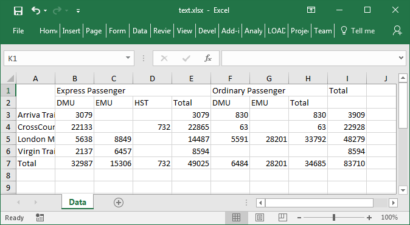
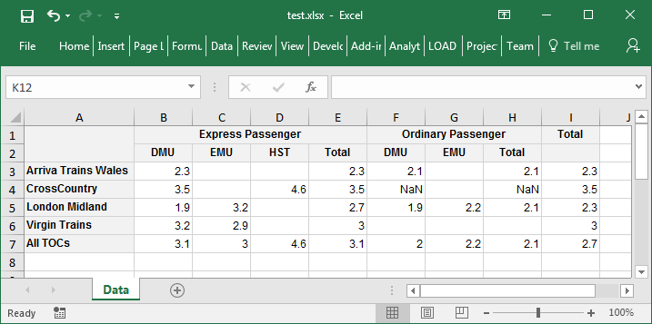

## In This Vignette

* Overview
* Basic Export (no styling)
* Styling and Formatting
* Formatting Values
* Column Widths and Row Heights
* Performance
* Styling Reference
* Further Reading

## Overview

The pivottabler package can export a pivot table to an Excel file.  Only Excel 2007 onwards (*.xlsx) files are supported.  This export uses the openxlsx package.

This vignette starts with a basic (unformatted) export.  Following this are various styled/formatted examples.

## Basic Export (no styling)

Exporting a pivot table to an Excel table is reasonably straightforward:

1. Create the pivot table,
2. Using the openxlsx package, create a new Excel file and add a worksheet (or open an existing worksheet),
3. Call the `writeToExcelWorksheet` method on the pivot table.
4. Using the openxlsx package, save the workbook.

```{r, message=FALSE, warning=FALSE, eval=FALSE}
library(pivottabler)
pt <- PivotTable$new()
pt$addData(bhmtrains)
pt$addColumnDataGroups("TrainCategory")
pt$addColumnDataGroups("PowerType")
pt$addRowDataGroups("TOC")
pt$defineCalculation(calculationName="TotalTrains", summariseExpression="n()")
pt$evaluatePivot()

library(openxlsx)
wb <- createWorkbook(creator = Sys.getenv("USERNAME"))
addWorksheet(wb, "Data")
pt$writeToExcelWorksheet(wb=wb, wsName="Data", 
                         topRowNumber=1, leftMostColumnNumber=1, applyStyles=FALSE)
saveWorkbook(wb, file="C:\\test.xlsx", overwrite = TRUE)
```




## Styling and Formatting

The Excel output from the `pivottabler` package has been written so that, as much as possible, the same styling used for HTML output also works for the Excel output, i.e. most of the styling described in the [Styling](v06-styling.html) vignette can also be used when writing a pivot table to an Excel file.

More specifically, the styling described in the [Styling](v06-styling.html) vignette uses CSS (Cascading Style Sheet) definitions for styles.  The `pivottabler` package interprets these CSS definitions and maps them to the styling used in Excel/by the openxlsx package.

This means, once a pivot table has been styled as described in the [Styling](v06-styling.html) vignette, the pivot table in the Excel workbook can be styled simply by specifying `applyStyles=TRUE`.

```{r, message=FALSE, warning=FALSE, eval=FALSE}
library(pivottabler)
pt <- PivotTable$new()
pt$addData(bhmtrains)
pt$addColumnDataGroups("TrainCategory")
pt$addColumnDataGroups("PowerType")
pt$addRowDataGroups("TOC")
pt$defineCalculation(calculationName="TotalTrains", summariseExpression="n()")
pt$evaluatePivot()

library(openxlsx)
wb <- createWorkbook(creator = Sys.getenv("USERNAME"))
addWorksheet(wb, "Data")
pt$writeToExcelWorksheet(wb=wb, wsName="Data", 
                         topRowNumber=1, leftMostColumnNumber=1, 
                         applyStyles=TRUE, mapStylesFromCSS=TRUE)
saveWorkbook(wb, file="C:\\test.xlsx", overwrite = TRUE)
```


In general, the CSS mappings described above will simplify outputting to Excel.  However, not all CSS definitions can be mapped to Excel.  Excel also has some style settings that don't map to CSS.  There may also be occasions where different styling is desired in Excel vs. HTML.  To support all of these scenarios, a second set of styling properties are also supported.  These all begin with "xl-" and have roughly similar (but not exactly the same) names to their CSS counterparts, e.g. the property corresponding to CSS "font-family" is "xl-font-name". If both the "xl-..." Excel property and the CSS property are specified, the Excel value is used.  If `mapStylesFromCSS=FALSE` is specified, then the CSS properties are ignored and only the "xl-..." properties are used.

The table at the bottom of this vignette details the full set of CSS and Excel style properties that are supported.

## Formatting Values

There are a few different ways for format the values written into the worksheet.  These are controlled by the `outputValuesAs` parameter.  The following pivot table will be used to illustrate the different values for this parameter:

```{r, message=FALSE, warning=FALSE}
library(pivottabler)
library(dplyr)
library(lubridate)

# derive some additional data
trains <- mutate(bhmtrains,
   ArrivalDelta=difftime(ActualArrival, GbttArrival, units="mins"),
   ArrivalDelay=ifelse(ArrivalDelta<0, 0, ArrivalDelta))

# create the pivot table
pt <- PivotTable$new()
pt$addData(trains)
pt$addColumnDataGroups("TrainCategory")
pt$addColumnDataGroups("PowerType")
pt$addRowDataGroups("TOC", totalCaption="All TOCs")
pt$defineCalculation(calculationName="MeanArrivalDelay", caption="Mean Arr. Delay", 
                     summariseExpression="mean(ArrivalDelay, na.rm=TRUE)", format="%.1f")
pt$renderPivot()
```

### Raw Value

Specifying `outputValuesAs="rawValue"` will output the raw unformatted values.  This is also the default if no value is explicitly specified for the `outputValuesAs` parameter.

```{r, message=FALSE, warning=FALSE, eval=FALSE}
library(pivottabler)
library(dplyr)
library(lubridate)

# derive some additional data
trains <- mutate(bhmtrains,
   ArrivalDelta=difftime(ActualArrival, GbttArrival, units="mins"),
   ArrivalDelay=ifelse(ArrivalDelta<0, 0, ArrivalDelta))

# create the pivot table
pt <- PivotTable$new()
pt$addData(trains)
pt$addColumnDataGroups("TrainCategory")
pt$addColumnDataGroups("PowerType")
pt$addRowDataGroups("TOC", totalCaption="All TOCs")
pt$defineCalculation(calculationName="MeanArrivalDelay", caption="Mean Arr. Delay", 
                     summariseExpression="mean(ArrivalDelay, na.rm=TRUE)", format="%.1f")
pt$evaluatePivot()

library(openxlsx)
wb <- createWorkbook(creator = Sys.getenv("USERNAME"))
addWorksheet(wb, "Data")
pt$writeToExcelWorksheet(wb=wb, wsName="Data", 
                         topRowNumber=1, leftMostColumnNumber=1,
                         outputValuesAs="rawValue",
                         applyStyles=TRUE, mapStylesFromCSS=TRUE)
saveWorkbook(wb, file="C:\\test.xlsx", overwrite = TRUE)
```

Rounding the values as part of the calculation definition is one option that could be used with `outputValuesAs="rawValue"`.


### Formatted Values (as text)

Specifying `outputValuesAs="formattedValueAsText"` will output the formatted values - i.e. the calculation results that have been formatted according to the `format` parameter in the `defineCalculation()` function.  The formatted values are text however, so when exported to Excel this typically results in a warning in the corner of each cell that the number in the cell has been stored as text:


### Formatted Values (as numbers)

Specifying `outputValuesAs="formattedValueAsNumber"` will output the formatted values as numbers - i.e. the same values as shown in the screen shot above, but converted back to numerical values (where possible) - so eliminating the warnings shown above:



### Using Excel to format the values

The `outputValuesAs` parameter provides a simple way to control value formatting.  However, this applies to every cell in the pivot table, so is not a very fine grained control.

Another option is to output the raw unformatted values to Excel and then specify an Excel format string to allow Excel to format the values.  The Excel format string is specified in the styling of cells, either as part of the theme (but this leaves little flexibility for different calculations) or more flexibly, by adding format codes to individual cells / groups of cells after the pivot table has been populated.  To do this, a new style is applied to each cell, based on an existing style in the theme.  In the example below, the new style is based on the existing "Cell" style, but with a value format string applied.

```{r, message=FALSE, warning=FALSE, eval=FALSE}
library(pivottabler)
library(dplyr)
library(lubridate)

# derive some additional data
trains <- mutate(bhmtrains,
   ArrivalDelta=difftime(ActualArrival, GbttArrival, units="mins"),
   ArrivalDelay=ifelse(ArrivalDelta<0, 0, ArrivalDelta))

# create the pivot table
pt <- PivotTable$new()
pt$addData(trains)
pt$addColumnDataGroups("TrainCategory")
pt$addColumnDataGroups("PowerType")
pt$addRowDataGroups("TOC", totalCaption="All TOCs")
pt$defineCalculation(calculationName="MeanArrivalDelay", caption="Mean Arr. Delay", 
                     summariseExpression="mean(ArrivalDelay, na.rm=TRUE)", format="%.1f")
pt$evaluatePivot()
# style setting function
setStyle <- function(cell, baseStyleName, declarations) {
  if(is.null(cell$style)) 
    cell$style <- pt$createInlineStyle(baseStyleName=baseStyleName, declarations=declarations)
  else cell$style$setPropertyValues(declarations=declarations)
}
# set the styling on the cells
cells <- pt$findCells(calculationNames="MeanArrivalDelay")
invisible(lapply(cells, setStyle, baseStyleName="Cell", declarations=list("xl-value-format"="##0.0")))

library(openxlsx)
wb <- createWorkbook(creator = Sys.getenv("USERNAME"))
addWorksheet(wb, "Data")
pt$writeToExcelWorksheet(wb=wb, wsName="Data", 
                         topRowNumber=1, leftMostColumnNumber=1,
                         outputValuesAs="rawValue",
                         applyStyles=TRUE, mapStylesFromCSS=TRUE)
saveWorkbook(wb, file="C:\\test.xlsx", overwrite = TRUE)
```


## Column Widths and Row Heights

It is possible to specifying a minimum row height and/or column width as part of the styling.  The relevant styling properties are "xl-min-row-height" and "xl-min-column-width".

Rows/columns are sized to meet all of the minimum sizes specified.  E.g. if three cells in the same row have minimum row heights of 40, 45 and 50 specified, the row height will be set to 50.

## Performance

Creating Excel files is relatively effort intensive.  Outputing pivot tables to Excel files requires more time than creating a HTML representation of a pivot table.  In order of increasing time required:

* Unstyled Pivot Tables - these will be written to Excel quicker than styled pivot tables.
* Pivot tables using only base styles - i.e. where no additional styles have been applied to individual cells in the pivot table - these take a moderate amount of time to write to Excel.
* Pivot tables with styles applied to individual cells - these take the longest amount of time to write to Excel due to the extra effort of handling the styles applied to individual cells.

## Styling Reference

The following table details the styling properties that are supported.

| CSS Property       | XL Property         | XL Example              | Notes                                      | 
|:-------------------|:--------------------|:------------------------|:-------------------------------------------|
| font-family        | xl-font-name        | Arial                   | Only the first CSS font is used in Excel.  |
| font-size          | xl-font-size        | 12                      | In Points (4-72).  See below for CSS units.|
| font-weight        | xl-bold             | normal or bold          | XL bold is CSS font-weight >= 600.         |
| font-style         | xl-italic           | normal or italic        | italic and oblique map to italic.          |
| text-decoration    | xl-underline        | normal or underline     |                                            |
| text-decoration    | xl-strikethrough    | normal or strikethrough |                                            |
| background-color   | xl-fill-color       | #FF0000                 | See below for supported CSS colours.       |
| color              | xl-text-color       | #00FF00                 | See below for supported CSS colours.       |
| text-align         | xl-h-align          | left or center or right |                                            |
| vertical-align     | xl-v-align          | top or middle or bottom |                                            |
| white-space        | xl-wrap-text        | normal or wrap          |                                            |
|                    | xl-text-rotation    | 90                      | 0 to 359, or 255 for vertical text.        |
|                    | xl-indent           | 20                      | 0 to 250.                                  |
| border             | xl-border           | thin black              | See below for supported CSS border values. |
| border-left        | xl-border-left      | thin black              | See below for supported CSS border values. |
| border-right       | xl-border-right     | thin black              | See below for supported CSS border values. |
| border-top         | xl-border-top       | thin black              | See below for supported CSS border values. |
| border-bottom      | xl-border-bottom    | thin black              | See below for supported CSS border values. |
|                    | xl-min-column-width | 50                      | 0 to 255.                                  |
|                    | xl-min-row-height   | 45                      | 0 to 400.                                  |
|                    | xl-value-format     | #,###.00                | See notes below for full details.          |

Notes:

* For CSS font-size, only the following units are supported:  in, cm, mm, pt, pc, px, em, %.
* For CSS background-color, CSS color and border colours, only hex colours, named colours, RGB() and RGBA() values are supported.  HLS() and HLSA() values are not supported.  Examples of supported CSS values:  #0080FF, rgb(0, 128, 255), rgba(0, 128, 255, 0.5), red, black, darkolivegreen, etc.
* For borders, either use CSS border / xl-border to specify the same border on all four sides of each cell.  Or use the side-specific versions, e.g. CSS border-left / xl-border-left.
* For XL border styles, the allowed range of values is:  none thin, medium, dashed, dotted, thick, double, hair, mediumDashed, dashDot, mediumDashDot, dashDotDot, mediumDashDotDot, slantDashDot
* For xl-value-format, the following constants are supported: GENERAL, NUMBER, CURRENCY, ACCOUNTING, DATE, LONGDATE, TIME, PERCENTAGE, FRACTION, SCIENTIFIC, TEXT, COMMA.  Alternatively, custom format strings can be specified.  For date/datetime, specify a combination of d, m, y, e.g. dd/mm/yyyy.  For numeric rounding use 0.00 etc.

Note that the following CSS properties are NOT supported:

* font - use font-family, font-size, etc. instead
* Border side specific properties, e.g. border-left-style, border-top-color, etc.


## Further Reading

The full set of vignettes is:

1. [Introduction](v01-introduction.html)
2. [Data Groups](v02-datagroups.html)
3. [Calculations](v03-calculations.html)
4. [Outputs](v04-outputs.html)
5. [Latex Output](v05-latexoutput.html)
6. [Styling](v06-styling.html)
7. [Finding and Formatting](v07-findingandformatting.html)
8. [Cell Context](v08-cellcontext.html)
9. [Irregular Layout](v09-irregularlayout.html)
10. [Performance](v10-performance.html)
11. [Shiny](v11-shiny.html)
12. [Excel Export](v12-excelexport.html)
